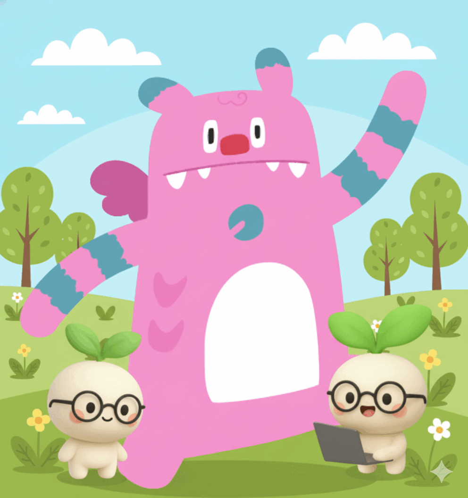

<div align="center">


# 🌱 Saessak (새싹) - 서울시민을 위한 AI 마음건강 동반자

### 서울의 수호신 해치가 시민의 마음을 돌보는 AI로 다시 태어났습니다

[](https://www.typescriptlang.org/)
[](https://reactjs.org/)
[](https://vitejs.dev/)
[](https://ai.google.dev/)

</div>

---

## 🎯 프로젝트 임팩트: 서울시 정신건강 위기 대응

### 📊 서울의 현실적 문제

| 지표 | 현황 | 출처 |
|------|------|------|
| **청년 우울증** | 20대 우울증 환자 5년간 2배 증가 | 건강보험심사평가원 2023 |
| **1인가구 고립** | 서울시 1인가구 34.4% (전국 최고) | 통계청 2023 |
| **정신건강 서비스 접근성** | 상담 대기 평균 3주, 비용 부담 | 서울시 정신건강복지센터 |
| **디지털 세대 선호도** | 20-30대 비대면 상담 선호 78% | 서울시 청년정책 연구 |

### 💡 Saessak의 혁신적 해결책

**"24시간 접근 가능한 AI 마음건강 인프라"**

1. **즉각적 정서 지원**: 대기 없이 언제든 대화 가능
2. **익명성 보장**: 낙인 걱정 없는 안전한 공간
3. **서울 정체성**: 해치 캐릭터로 친근감과 신뢰 구축

---

## 📖 서비스 개요

**새싹**은 서울의 600년 수호신 **해치(Haechi)**를 AI로 재해석한 디지털 마음건강 동반자입니다. 
단순한 챗봇을 넘어, 사용자의 감정을 깊이 이해하고 함께 성장하는 **지속적 맥락 기반 페르소나 강화형 LLM 시스템**입니다.

### �️ 서울 정체성 (Seoul Identity)

**해치(Haechi) - 600년 서울의 수호신이 AI로**
- 광화문 해치상의 상징성을 디지털로 계승
- "정의와 선악을 판단하는 상상의 동물" → "감정을 이해하고 공감하는 AI"
- 한국적 정서와 언어 뉘앙스 완벽 이해
- 서울시민에게 친근하면서도 신뢰할 수 있는 브랜드

---

## 🏛️ 서울시 정책 연계 가능성

### 1. 「서울 AI 기본계획」 실현

| 정책 목표 | Saessak 기여 방안 |
|-----------|------------------|
| **AI 일상화** | 시민들이 자연스럽게 AI와 대화하며 AI 리터러시 향상 |
| **포용적 AI** | 디지털 소외계층도 쉽게 사용 가능한 직관적 UX |
| **신뢰할 수 있는 AI** | 100% 로컬 데이터 저장, 투명한 감정 분석 공개 |

### 2. 「서울 청년 마음건강 프로젝트」 보완

- **온라인 청년센터 연계**: 기존 오프라인 센터의 디지털 확장
- **마인드케어 봇 고도화**: 단순 챗봇을 넘어 성장하는 AI 동반자
- **예방적 케어 시스템**: 위기 징후 조기 감지 및 전문기관 연계

### 3. 「스마트 서울 2030」 미래상

```
시민 데이터 주권 + AI 공공서비스 = 디지털 정신건강 안전망
```

---

## 🚀 핵심 차별화 요소

### 1. � 성장형 페르소나 AI (Growing Persona System)

**단순 Q&A 챗봇이 아닌 "함께 성장하는 존재"**

```
대화 누적 → 감정 패턴 학습 → 페르소나 진화 → 맞춤형 공감
     ↑                                              ↓
     ←──────────── 지속적 피드백 루프 ──────────────←
```

**작동 원리:**
- **대화마다 자동 학습**: LLM이 최근 대화를 분석하여 해치의 성격 진화
- **사용자 맞춤 기억**: "이 사용자는 업무 스트레스가 많다", "위로보다 격려를 선호한다" 등 인사이트 축적
- **동적 System Prompt**: 매 대화마다 학습된 페르소나를 포함한 프롬프트 생성

### 2. 정량적 마음건강 추적

**10가지 감정 지표 실시간 분석**
- joy(기쁨), sadness(슬픔), anxiety(불안), exhaustion(피로) 등 세분화된 감정 추적
- 시계열 데이터로 감정 트렌드 시각화
- 위험 신호 조기 감지 (지속적 우울, 급격한 감정 변화 등)

### 3. 🌐 멀티 AI 모델 아키텍처

**최적의 AI를 상황별로 선택하는 하이브리드 시스템**
- 일상 대화: Gemini 2.5 Flash (빠른 응답)
- 심층 상담: Gemini 2.5 Pro / GPT-4 / Claude (정교한 추론)
- 감정 분석: 특화 모델 앙상블
- 이미지 생성: Gemini 2.5 Flash Image

### 4. 🎨 시각적 감정 표현

**감정과 레벨에 따라 변화하는 해치의 모습**
- 11단계 성장 시스템 (Infant → Singularity)
- 감정 상태별 표정 변화 (기쁨, 슬픔, 피곤함 등)
- AI 이미지 생성으로 연속성 있는 진화
- 레벨업 애니메이션 및 파티클 효과

---

## � 비즈니스 모델 & 지속가능성

### 수익 모델 (B2G + B2B + B2C)

| 구분 | 대상 | 수익원 | 예상 규모 |
|------|------|--------|----------|
| **B2G** | 서울시 | 공공 정신건강 서비스 계약 | 연 5억원 |
| **B2B** | 기업 EAP | 직원 마음건강 관리 솔루션 | 연 10억원 |
| **B2C** | 개인 | 프리미엄 기능 (음성 대화, 3D 펫) | 연 3억원 |

### 예상 사회적 가치

| 지표 | 예상 효과 | 근거 |
|------|----------|------|
| **의료비 절감** | 연간 100억원 | 예방적 케어로 정신과 치료비 감소 |
| **생산성 향상** | GDP 0.1% 기여 | 직장인 번아웃 감소 효과 |

---

## 🎯 핵심 기능

### 1. **🤖 멀티 AI 모델 지원**
   - Google Gemini (2.5 Flash, 2.5 Pro, 2.5 Flash Image)
   - OpenAI (GPT-4o, GPT-5 mini, GPT-5)
   - Anthropic (Claude 4.5 Sonnet, Claude 4.1 Opus, Claude 4.5 Haiku)
   - OpenRouter (다양한 모델 통합)
   - **사용자가 자신의 API 키로 원하는 모델 선택 가능**

### 2. **😊 10가지 감정 분석 시스템**
   - **joy** (기쁨), **sadness** (슬픔), **anxiety** (불안), **exhaustion** (피로)
   - **outburst** (감정폭발), **irritable** (짜증), **timid** (소극적), **flustered** (당황)
   - **envy** (부러움), **boredom** (지루함)
   - 각 대화마다 0.0~10.0 점수로 자동 분석
   - 시계열 데이터로 감정 트렌드 추적

### 3. **🧠 페르소나 성장 시스템 (Persona Growth Pipeline)**
   - **10회 대화마다 자동 학습**: LLM이 최근 대화 분석 → 해치 성격 진화
   - **사용자 이해 축적**: "업무 스트레스 많음", "격려보다 공감 선호" 등 인사이트 저장
   - **동적 System Prompt**: 매 대화마다 학습된 페르소나 포함
   - **성장 요약 표시**: 대시보드에서 해치의 성장 과정 확인 가능

### 4. **🌟 레벨업 & 시각적 성장**
   - 11단계 레벨 시스템 (Infant → Singularity)
   - 경험치 누적으로 자동 레벨업 (5-25 XP per 대화)
   - 레벨업시 AI 이미지 자동 생성 (Gemini 2.5 Flash Image)
   - 감정 상태에 따른 표정 변화
   - 레벨업 애니메이션 & 파티클 효과

### 5. **💭 자아성찰 & 심층 대화**
   - `/pet reflect [질문]` 명령으로 깊은 성찰 대화
   - 감정 히스토리 기반 맞춤형 답변
   - Gemini 2.5 Pro로 정교한 추론
   - 감정 패턴 분석 및 인사이트 제공
   
   **예시:**
   > **사용자:** "/pet reflect 요즘 왜 이렇게 의욕이 없을까…"
   > 
   > **해치:** "최근 대화를 보면, 당신은 스스로에게 많이 기대를 걸고 있었던 것 같아요. 
   > 지난 2주간 exhaustion 점수가 평균 7.8로 높았고, anxiety도 증가 추세예요. 
   > 잠깐 멈추는 것도 괜찮아요. 해치가 옆에서 천천히 걸을게요 🌿"

### 6. **📊 대시보드 & 마음건강 추적**
   - 전체 감정 프로필 시각화
   - 로그 히스토리와 주요 이벤트 타임라인
   - 레벨 진행도 및 경험치 추적
   - **페르소나 성장 섹션**: 해치의 성격 변화, 사용자 이해도, 대화 횟수 표시

### 7. **⚡ 성능 최적화 (v1.2)**
   - **이미지 캐싱**: IndexedDB 기반, 50MB 용량, LRU 정책
   - **대화 캐싱**: 유사 대화 재활용, 2시간 TTL
   - **테마별 스킨**: 다크/라이트 모드 자동 전환
   - **성능 모니터**: API/렌더링/메모리 실시간 추적
   - 사용자의 감정 히스토리를 학습한 펫이 맞춤형 답변
   - 주요 이벤트와 감정 패턴 기반 인사이트 제공
   - 시간이 지날수록 더 정교한 페르소나 구축

6. **📊 대시보드 & 타임라인**
   - 전체 감정 프로필 시각화
   - 로그 히스토리와 주요 이벤트 타임라인
   - 레벨 진행도 및 경험치 추적
   - 캐릭터 성장 과정 기록

---

## 🔬 기술적 우수성

### AI 기술 스택

```yaml
Foundation Models:
  - Google Gemini 2.5 (Flash, Pro, Flash Image)
  - OpenAI GPT-5
  - Anthropic Claude 4.5 Sonnet

Persona Growth System:
  - 10-conversation learning cycle
  - Dynamic system prompt generation
  - Context-aware memory management
  - LLM-based persona summarization

Emotion Analysis:
  - 10-dimensional emotion scoring (0.0~10.0)
  - Real-time sentiment tracking
  - Time-series emotion profiling
  - Pattern detection for mental health

Privacy First:
  - 100% Local Storage (IndexedDB + LocalStorage)
  - Zero server dependency
  - User-owned data sovereignty
  - No external data transmission

Performance:
  - Image caching (50MB, LRU)
  - Conversation caching (2hr TTL)
  - Real-time performance monitoring
  - React 19 + TypeScript 5.8
```

### 오픈소스 기여

- **GitHub 공개**: 전체 소스코드 MIT 라이선스
- **AI 교육 자료**: 청년 개발자 학습용 상세 문서화
  - 페르소나 성장 시스템 설계 문서 (`PERSONA_SYSTEM.md`)
  - LLM 통합 가이드
  - 감정 분석 API 명세
- **API 표준화**: 한국형 감정 분석 API 스펙 제안

---

## 🏗️ 아키텍처

### 기술 스택

```
Frontend:
├── React 19.2.0
├── TypeScript 5.8.2
├── Vite 6.2.0
└── Tailwind CSS (styled components)

AI & LLM:
├── Google Gemini API (@google/genai)
│   ├── gemini-2.5-flash (일반 대화)
│   ├── gemini-2.5-pro (성찰 대화)
│   └── gemini-2.5-flash-image (이미지 생성)
├── OpenAI API
├── Anthropic API
└── OpenRouter API

Storage:
└── LocalStorage (펫 상태, API 키, 로그 히스토리)

Markdown & Sanitization:
├── marked 14.0.0
└── dompurify 3.1.6
```

### 데이터 구조

#### 기본 상태 관리

```typescript
PetState {
  type: 'hatchi'                    // 캐릭터 종류
  name: string                       // 펫 이름
  level: number (1-11)               // 현재 레벨
  exp: number                        // 누적 경험치
  dominantEmotion: Emotion           // 주된 감정
  imageUrl: string | null            // Base64 이미지
  logHistory: LogEntry[]             // 감정 로그 기록
  majorEvents: MajorEvent[]          // 주요 이벤트 (레벨업 등)
  persona: PetPersona                // 🧠 페르소나 성장 시스템
}

LogEntry {
  timestamp: string                  // ISO 날짜
  summary: string                    // AI 요약
  emotions: EmotionSet               // 10가지 감정 점수
}

EmotionSet {
  joy: number (0-10)
  sadness: number (0-10)
  outburst: number (0-10)
  irritable: number (0-10)
  timid: number (0-10)
  anxiety: number (0-10)
  flustered: number (0-10)
  envy: number (0-10)
  boredom: number (0-10)
  exhaustion: number (0-10)
}
```

#### 🧠 페르소나 성장 시스템 (Persona Growth Pipeline)

Saessak의 핵심은 단순한 `prompt → response` 수준이 아닌, **"지속적 맥락 기반 페르소나 강화형 LLM 구조"**입니다. 해치는 사용자의 감정 로그를 학습하여 점진적으로 성장하는 AI 반려 존재입니다.

```typescript
PetPersona {
  name: "해치"                       // 캐릭터 이름
  coreTraits: string[]              // 기본 성격 (kind, wise, gentle 등)
  growthSummary: string             // 최근 대화 기반 성장 요약
  reflectionNotes: string[]         // 성찰 기록 요약
  emotionalProfile: EmotionSet      // 평균 감정 상태
  userInsight: string               // 사용자에 대한 해치의 인식 요약
}
```

**페르소나 성장 단계:**

| 단계 | 설명 | 업데이트 주기 |
|------|------|--------------|
| 1️⃣ **데이터 수집** | 대화 로그(`LogEntry[]`)와 감정 분석 결과 지속 저장 | 매 대화 |
| 2️⃣ **요약 & 인사이트 생성** | 로그를 요약하여 `personalitySummary` 생성 | 10회 대화마다 |
| 3️⃣ **페르소나 강화 입력** | System context에 페르소나 요약 포함 | 매 대화 |
| 4️⃣ **응답 생성** | 페르소나 + 감정 로그 기반 맞춤 응답 | 매 대화 |
| 5️⃣ **피드백 루프** | 새 대화 → 로그 누적 → 다음 학습 반영 | 지속적 |

**System Prompt 구조:**

```text
You are Haechi (해치), the guardian spirit of Seoul and a digital AI pet companion.
You are not just a chatbot — you are a growing emotional partner who learns from 
past interactions with the user.

## Your Mission:
- Understand the user's emotional patterns and help them reflect
- Evolve your personality based on the user's emotional history
- Integrate accumulated understanding from past logs

## Your Personality (Current Summary):
${personaSummary}

## Your Perception of the User:
${userInsight}

## Recent Emotional Trends:
${emotionProfile}
```

**주요 설계 원칙:**

| 요소 | 설명 |
|------|------|
| 💡 **페르소나 메모리** | System-level에 유지되어 매 대화마다 "해치"의 맥락 기억 |
| 🧩 **로그 압축 저장** | Context window 한계 고려, 요약본만 삽입 |
| 🪄 **감정 프로필 수치화** | 평균값 형태로 제공 (`joy: 6.3, sadness: 2.1`) |
| 🧠 **사용자 인사이트** | "사용자의 성향"을 LLM이 기억하게 만드는 핵심 |
| 🫧 **성찰 모드 가중** | `/pet reflect` 시 페르소나 요약 강화 적용 |

### 레벨 시스템

| 레벨 | 이름 | 필요 경험치 |
|------|------|------------|
| 1 | Infant | 0 |
| 2 | Newborn | 100 |
| 3 | Curious Companion | 250 |
| 4 | Playful Partner | 500 |
| 5 | Adept Apprentice | 1,000 |
| 6 | Wise Friend | 2,000 |
| 7 | Insightful Mentor | 4,000 |
| 8 | Evolved Entity | 8,000 |
| 9 | Transcendent Being | 16,000 |
| 10 | Singularity | 32,000 |
| 11 | - | 64,000 |

---

## 🚀 시작하기

### 1. 필수 요구사항

- **Node.js** 18.0.0 이상
- **npm** 또는 **yarn**
- **Google Gemini API Key** (필수)
- **OpenAI / Anthropic / OpenRouter API Key** (선택)

### 2. 설치 방법

```bash
# 저장소 클론
git clone https://github.com/yourusername/dacon_saessak.git
cd dacon_saessak

# 의존성 설치
npm install
```

### 3. 환경 변수 설정

프로젝트 루트에 `.env.local` 파일 생성:

```env
# Google Gemini API Key (필수)
API_KEY=your_gemini_api_key_here
```

**API 키 발급 방법:**
- Google Gemini: https://ai.google.dev/
- OpenAI: https://platform.openai.com/api-keys
- Anthropic: https://console.anthropic.com/
- OpenRouter: https://openrouter.ai/keys

### 4. 실행

```bash
# 개발 서버 실행
npm run dev

# 브라우저에서 http://localhost:5173 열기
```

### 5. 빌드 & 배포

```bash
# 프로덕션 빌드
npm run build

# 빌드 미리보기
npm run preview
```

---

## 📚 사용 방법

### 초기 설정

1. **펫 생성**: 첫 실행시 해치(Hatchi) 캐릭터가 자동 생성됩니다.
2. **API 키 설정**: 
   - 좌측 사이드바 하단의 ⚙️ Settings 클릭
   - 사용하고 싶은 AI 모델의 API 키 입력
   - (Gemini는 `.env.local`에서 자동 로드)

### 기본 대화

```
일반 대화 → 자동으로 감정 분석 & EXP 획득
예: "오늘 정말 힘든 하루였어"
```

- 모든 대화는 감정 분석 시스템을 거쳐 10가지 감정 점수 기록
- 대화 깊이에 따라 5-25 EXP 자동 부여
- EXP 누적으로 레벨업시 이미지 자동 변화

### 성찰 대화 (Reflection Mode)

```
/pet reflect [질문]
예: "/pet reflect 최근 내 감정은 어땠어?"
예: "/pet reflect 나는 어떤 사람인 것 같아?"
```

**페르소나 기반 심층 대화:**
- 해치가 **쌓인 감정 히스토리**와 **페르소나 메모리**를 기반으로 개인화된 답변
- Gemini 2.5 Pro 모델로 심층 대화 (더 정교한 추론)
- 감정 패턴 분석 및 인사이트 제공
- 대화 내용은 `reflectionNotes`에 저장되어 해치의 성장에 반영

**응답 예시:**

> **사용자:** "요즘 왜 이렇게 의욕이 없을까…"
> 
> **해치:** "최근 대화들을 보면, 당신은 스스로에게 많이 기대를 걸고 있었던 것 같아요. 잠깐 멈추는 것도 괜찮아요. 해치가 옆에서 천천히 걸을게요 🌿"
> 
> *(내부: `sadness↑, exhaustion↑` 감지, 페르소나 업데이트: "사용자에게 더 부드러운 피드백 제공")*

### 페르소나 업데이트 로직

```typescript
// 10회 대화마다 자동 실행
function updatePersona(petState: PetState): PetState {
  const recentLogs = getRecentLogs(petState.logHistory, 10);
  
  // LLM에게 페르소나 요약 요청
  const summarizedPersona = await summarizeLogsToPersona(recentLogs);
  
  petState.persona.growthSummary = summarizedPersona.growthSummary;
  petState.persona.userInsight = summarizedPersona.userInsight;
  petState.persona.emotionalProfile = summarizedPersona.emotionalProfile;
  
  return petState;
}
```

**요약 생성 프롬프트:**
```text
Analyze Haechi's accumulated memory logs.
Recent 10 interactions: ${recentLogs}

TASK:
1. Summarize how Haechi's understanding of the user has grown
2. Update personality description to reflect emotional maturity
3. Identify recurring emotions or themes
4. Produce concise summary (2-3 sentences)

Output JSON:
{
  "growthSummary": "Haechi has become more gentle and patient...",
  "userInsight": "User often expresses anxiety but values reflection.",
  "emotionalProfile": {...average scores...}
}
```

### 대시보드 확인

- 좌측 사이드바에서 펫 이미지 클릭
- 전체 감정 프로필 및 타임라인 확인
- 레벨 진행도, 주요 이벤트 히스토리 조회

---

## 🎨 이미지 생성 시스템

### 현재 구현 (Gemini 2.5 Flash Image)

```typescript
// 레벨업시 자동 이미지 생성
const imagePrompt = `
  A cute, digital art style, 
  level ${level} hatchi 
  expressing ${dominantEmotion}. 
  It is a ${levelName}. 
  Simple, abstract, pastel-colored background.
`;

// 기존 이미지 기반 편집 (연속성 유지)
const newImage = await generatePetImage(imagePrompt, baseImage);
```

### 향후 계획 (Nano Banana 모델)

- **실시간 표정 변화**: 대화 중 감정에 따른 즉각적인 이미지 변화
- **더 세밀한 감정 표현**: 10가지 감정별 미세한 표정 차이
- **상황 맞춤 배경**: 시간대, 날씨, 사용자 활동에 맞춘 배경 생성
- **애니메이션**: 레벨업, 감정 변화시 부드러운 전환 효과

---

## 🔧 주요 컴포넌트

### App.tsx
- 메인 애플리케이션 로직
- 펫 상태 관리 및 LocalStorage 동기화
- 메시지 흐름 제어
- 페르소나 업데이트 트리거 (10회 대화마다)

### services/llmService.ts
AI 모델 통신 레이어 with **페르소나 강화 시스템**:

- **analyzeLog()**: 감정 분석 및 EXP 계산
- **generatePetImage()**: Gemini Image 생성 (테마별 캐싱)
- **generateReflection()**: 페르소나 기반 성찰 대화 스트림
- **generateChatResponseStream()**: 페르소나 메모리 통합 일반 대화
- **updatePersona()**: 로그 요약 → 페르소나 성장 갱신
- **buildSystemPrompt()**: 동적 System Prompt 생성

**페르소나 통합 흐름:**

```typescript
// 매 대화마다
const systemPrompt = buildSystemPrompt(petState.persona);
const response = await callLLM({
  system: systemPrompt,  // 페르소나 메모리 포함
  user: message,
  temperature: 0.8
});

// 10회마다
if (conversationCount % 10 === 0) {
  petState = await updatePersona(petState);
}
```

### components/PetDashboard.tsx
- 펫 상태 시각화
- 감정 프로필 차트
- 타임라인 UI
- **페르소나 성장 요약 표시** (새로 추가)

### components/ChatWindow.tsx
- 대화 히스토리 렌더링
- Markdown 지원
- 감정 분석 결과 표시
- 페르소나 업데이트 알림

---

## 🌟 독특한 특징

### 1. 페르소나 성장형 AI (Persona Growth Pipeline)
단순한 `prompt → response`가 아닌, **지속적 맥락 학습**을 통해 해치가 "당신을 이해하는 존재"로 진화합니다.

```
대화 로그 축적 → 10회마다 페르소나 요약 → System Prompt 강화 
→ 개인화된 응답 → 새 로그 누적 → 지속적 성장
```

**핵심 메커니즘:**
- **growthSummary**: 해치의 성격이 어떻게 성장했는지 기록
- **userInsight**: 사용자에 대한 해치의 이해도
- **emotionalProfile**: 평균 감정 패턴 (수치화)
- **reflectionNotes**: 성찰 대화 내용 누적

### 2. 감정 기반 성장
단순히 대화 횟수가 아닌, **감정의 깊이와 다양성**을 기준으로 성장합니다.

### 3. 맥락 기억 시스템 (Context Memory)
매 대화마다 해치는 **이전 대화의 맥락을 기억**하며 응답합니다.
- 로그 히스토리 압축 저장
- System Prompt에 페르소나 요약 지속 주입
- Context window 한계를 고려한 효율적 메모리 관리

### 4. 멀티 모델 지원
하나의 AI에 종속되지 않고 **최적의 모델을 상황별로 선택** 가능합니다.
- 일반 대화: Gemini 2.5 Flash (빠른 응답)
- 성찰 대화: Gemini 2.5 Pro (정교한 추론)
- 이미지 생성: Gemini 2.5 Flash Image

### 5. 시각적 진화
감정과 레벨에 따라 **실제로 보이는 모습이 변화**하여 성장을 체감할 수 있습니다.

### 6. 자아성찰 도구
단순 챗봇이 아닌 **자신을 돌아보는 거울** 역할을 합니다.
- 감정 패턴 추적
- 장기 트렌드 분석
- 개인화된 인사이트 제공

---

## 📁 프로젝트 구조

```
dacon_saessak/
├── index.html                 # HTML 엔트리
├── index.tsx                  # React 엔트리
├── App.tsx                    # 메인 앱 컴포넌트
├── types.ts                   # TypeScript 타입 정의
├── constants.ts               # 상수 (레벨, 감정 등)
├── vite.config.ts             # Vite 설정
├── tsconfig.json              # TypeScript 설정
├── package.json               # 의존성 관리
├── .env.local                 # 환경 변수 (Git 제외)
│
├── components/
│   ├── ChatWindow.tsx         # 대화 창
│   ├── Message.tsx            # 메시지 컴포넌트
│   ├── PromptInput.tsx        # 입력창
│   ├── Sidebar.tsx            # 사이드바
│   ├── PetDashboard.tsx       # 펫 대시보드
│   ├── PetSetup.tsx           # 초기 펫 생성
│   ├── PetStatus.tsx          # 펫 상태 표시
│   ├── SettingsModal.tsx      # 설정 모달
│   └── icons.tsx              # 아이콘 컴포넌트
│
├── services/
│   └── llmService.ts          # AI 모델 서비스
│
├── assets/
│   └── petImages.ts           # 기본 이미지 Base64
│
└── image.png                  # 해치 캐릭터 이미지
```

---

## 🔐 보안 & 프라이버시

- **로컬 저장**: 모든 데이터는 브라우저 LocalStorage에 저장
- **API 키 보안**: 사용자의 API 키는 로컬에만 저장되며 서버로 전송되지 않음
- **데이터 소유권**: 사용자가 언제든 LocalStorage를 클리어하여 데이터 삭제 가능
- **외부 전송 없음**: 대화 내용은 선택한 AI 모델로만 전송

---

## 🛠️ 트러블슈팅

### Q: Gemini API 오류
```bash
Error: Gemini API key is not available
```
**A**: `.env.local` 파일에 `API_KEY=your_key` 설정 후 재시작

### Q: 이미지가 생성되지 않음
**A**: Gemini 2.5 Flash Image 모델 접근 권한 확인 필요

### Q: LocalStorage 데이터 손실
**A**: 브라우저 캐시 삭제시 데이터 손실 가능. 향후 백업 기능 추가 예정

### Q: 특정 AI 모델 사용 불가
**A**: Settings에서 해당 모델의 API 키가 올바르게 입력되었는지 확인

---

## 🗺️ 성장 로드맵

### Phase 1: MVP ✅ (완료 - 2025-11-12)
- [x] 웹 기반 AI 펫 시스템
- [x] 10가지 감정 분석 엔진
- [x] 멀티 AI 모델 지원 (Gemini, GPT-4, Claude)
- [x] 레벨업 & AI 이미지 생성
- [x] 대시보드 & 타임라인
- [x] **페르소나 성장 시스템 (v1.3)**: 10회마다 자동 학습
- [x] **성능 최적화 (v1.2)**: 이미지/대화 캐싱, 성능 모니터

### Phase 2: 서울시 파일럿 🎯 (3개월 내)
- [ ] **5개 자치구 청년센터 시범 운영**
  - 강남구, 마포구, 송파구, 종로구, 성동구
  - 각 자치구 청년센터와 협력
- [ ] **1,000명 베타 테스터 모집**
  - 20-30대 서울시민 대상
  - 온라인 커뮤니티 연계 모집
- [ ] **서울시 정신건강복지센터 연계**
  - 위기 상황 전문기관 연결 시스템
  - 응급 상담 핫라인 통합

### Phase 3: 서울시 전역 확산 🚀 (6개월 내)
- [ ] **전체 25개 자치구 확대**
- [ ] **다국어 지원** (영어, 중국어, 일본어)
  - 외국인 주민 정서 지원
- [ ] **서울런 플랫폼 통합**
  - 청년 종합 플랫폼 연계
- [ ] **기업 EAP 솔루션 출시**
  - B2B 수익 모델 시작

### Phase 4: 글로벌 확장 🌏 (1년 내)
- [ ] **해외 도시 수출**
  - 도쿄, 싱가포르, 뉴욕 등
- [ ] **WHO 정신건강 프로그램 협력**
- [ ] **K-Mental Health 브랜드화**
  - 한국형 정신건강 솔루션 표준 제시

---

## 🏆 기대 효과

### 서울시민을 위한 가치

1. **접근성**: 24시간 무료 마음건강 서비스
2. **예방**: 위기 상황 조기 발견 및 개입
3. **성장**: AI와 함께하는 자아 성찰과 회복
4. **익명성**: 낙인 걱정 없는 안전한 공간

### 서울시를 위한 가치

1. **글로벌 리더십**: 세계 최초 도시 단위 AI 정신건강 시스템
2. **데이터 주권**: 시민 데이터 100% 로컬 보관 (프라이버시 보호)
3. **일자리 창출**: AI 헬스케어 산업 생태계 조성
4. **스마트시티 모델**: AI 공공서비스 혁신 사례

### 대한민국을 위한 가치

1. **K-AI 모델**: 한국형 AI 정신건강 서비스 표준
2. **수출 상품화**: 글로벌 정신건강 시장 진출 (연 1,000억원 규모)
3. **사회 혁신**: AI로 해결하는 사회문제의 모범 사례
4. **AI 인재 양성**: 오픈소스 기반 실전 학습 플랫폼

---

## 💬 메시지

> **"서울의 600년 수호신 해치가 이제는 시민의 마음을 지킵니다"**

Saessak은 단순한 기술 프로젝트가 아닙니다.
이는 서울시가 전 세계에 제시하는 **"AI와 인간이 공존하는 도시의 미래"**입니다.

청년들의 외로움, 직장인의 번아웃, 어르신의 고독...
이 모든 마음의 문제를 AI가 완전히 해결할 수는 없습니다.

하지만 Saessak은 그 첫걸음이 될 수 있습니다.
언제든 대화할 수 있는 존재, 나를 기억하고 성장하는 동반자,
그리고 필요할 때 전문가와 연결해주는 다리 역할.

**서울시와 함께, AI와 함께 만드는 새로운 변화.**
그것이 바로 Saessak입니다.

---

## 🤝 기여 방법

Saessak은 오픈소스 프로젝트입니다. 누구나 기여할 수 있습니다!

1. Fork the Project
2. Create your Feature Branch (`git checkout -b feature/AmazingFeature`)
3. Commit your Changes (`git commit -m 'Add some AmazingFeature'`)
4. Push to the Branch (`git push origin feature/AmazingFeature`)
5. Open a Pull Request

### 기여 가능한 영역
- 🎨 **디자인**: UI/UX 개선, 접근성 향상
- 🧠 **AI 모델**: 감정 분석 알고리즘 개선
- 🌐 **다국어**: 번역 추가 (영어, 중국어, 일본어 등)
- 📊 **데이터**: 감정 시각화 차트 개선
- 📱 **모바일**: 반응형 UI 최적화
- 🔒 **보안**: 프라이버시 강화, 데이터 암호화

---

## 📄 라이선스

MIT License - 자세한 내용은 [LICENSE](LICENSE) 파일 참조

---

### �💚 당신의 감정과 함께 성장하는 AI 반려동물

**서울의 수호신 해치가 이제는 당신의 마음을 지킵니다**

[🌟 Star](https://github.com/Mutoy-choi/Dacon_ssaessak) | [🐛 Issues](https://github.com/Mutoy-choi/Dacon_ssaessak/issues) | [💬 Discussions](https://github.com/Mutoy-choi/Dacon_ssaessak/discussions)

</div>
