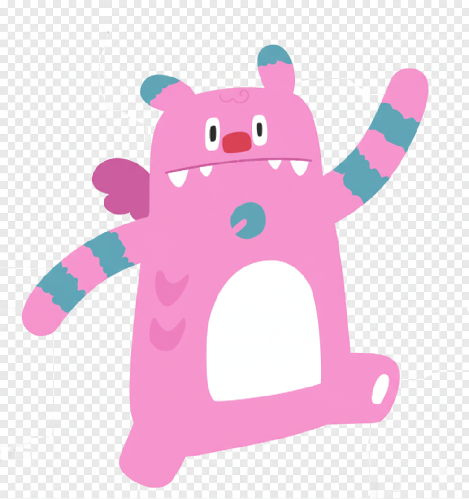

<div align="center">


# 🌱 Saessak (새싹) - AI Pet Companion

### 당신의 감정을 기록하고 함께 성장하는 AI 반려동물

[](https://www.typescriptlang.org/)
[](https://reactjs.org/)
[](https://vitejs.dev/)
[](https://ai.google.dev/)

</div>

---

## 📖 프로젝트 개요

**Saessak (새싹)**은 사용자의 감정을 분석하고 함께 성장하는 AI 반려동물 서비스입니다. 
일상의 대화와 감정을 기록하면서 펫이 레벨업하고, 시간이 지나면서 사용자의 페르소나를 학습하여 
자아성찰과 대화가 가능한 독특한 AI 챗봇 경험을 제공합니다.

### 🌍 사회적 가치와 비전

현대 사회는 기술이 발전할수록 정서적 고립과 감정적 피로가 커지고 있습니다. Saessak은 이러한 사회적 문제에 주목하여, **AI를 통해 감정 관리와 자아 성찰을 돕는 디지털 반려동물**로 기획되었습니다.

#### 💚 정서적 웰빙 지원
사용자의 대화를 기반으로 감정을 분석하고 기록하며, 스스로의 감정 패턴을 이해하도록 돕습니다. 이는 우울감, 불안, 스트레스 등 정신 건강 관리의 초기 단계를 지원하는 AI 기반 솔루션입니다.

#### 🤝 디지털 힐링 동반자
혼자 있는 청년, 사회 초년생, 감정 표현이 어려운 사람들도 "대화 가능한 AI 반려 존재"를 통해 위로와 동기부여를 얻을 수 있습니다.

#### 📚 AI 리터러시 향상
사용자는 Saessak을 통해 자연스럽게 다양한 AI 모델(Gemini, GPT, Claude 등)을 활용하며, 멀티 모델 이해력과 AI 활용 역량을 기를 수 있습니다.

### 💡 사회문제 해결과 청년 성장의 연결

| 기여 영역 | Saessak의 역할 |
|----------|----------------|
| 🧠 **청년 정신건강** | AI 감정 반려 시스템을 통해 사회적 고립, 번아웃, 감정 표현 부족 등 청년 세대의 정신적 문제 완화 |
| 🎓 **AI 인재 양성** | 오픈소스로 개발되어 누구나 기여하고 확장 가능. AI 대화 모델, 감정 분석, 이미지 생성 등 핵심 기술 실습 |
| 🌐 **지속 가능한 생태계** | 개인 감정 데이터를 로컬 중심으로 관리하여 프라이버시 보호. 데이터 윤리와 AI 책임성의 모범 사례 제시 |

### 🧭 AI와 함께 만드는 새로운 변화

Saessak은 "AI가 인간을 대체하는 도구"가 아니라, **"AI가 인간의 감정을 이해하고 함께 성장하는 존재"**라는 새로운 관점을 제시합니다. 이는 인간 중심의 AI 디자인, 즉 AI와 함께 마음의 성장과 회복을 그려나가는 변화의 모델입니다.

> *"AI를 통해 사람과 사회가 함께 성장할 수 있는 방식을 탐구합니다. AI가 우리의 감정을 기록하고 이해함으로써, 서로의 마음을 잇는 다리가 되는 것이 Saessak의 비전입니다."*

### 🎯 핵심 기능

1. **🤖 멀티 AI 모델 지원**
   - Google Gemini (2.5 Flash, 2.5 Pro)
   - OpenAI (GPT-4o, GPT-4o mini, GPT-4 Turbo)
   - Anthropic (Claude 3.5 Sonnet, Claude 3 Opus, Claude 3 Haiku)
   - OpenRouter (다양한 모델 통합)
   - 사용자가 자신의 API 키로 원하는 모델 사용 가능

2. **😊 감정 분석 시스템**
   - 10가지 감정 트래킹: joy, sadness, outburst, irritable, timid, anxiety, flustered, envy, boredom, exhaustion
   - 각 대화마다 감정 점수 자동 분석 (0.0 ~ 10.0)
   - AI가 대화 내용을 요약하고 경험치 부여 (5-25 XP)

3. **🌟 레벨업 & 성장 시스템**
   - 11단계 레벨 시스템 (Infant → Singularity)
   - 경험치 누적으로 자동 레벨업
   - 레벨업시 캐릭터 이미지 자동 변화 (Gemini Image Generation)
   - 감정 상태에 따른 동적 이미지 생성

4. **🎨 AI 이미지 생성 (Nano Banana 기반 계획)**
   - Gemini 2.5 Flash Image 모델 활용
   - 펫의 감정과 상황에 맞는 표정 변화
   - Base64 이미지 편집으로 연속성 유지
   - 레벨별 진화된 모습 자동 생성

5. **💭 자아성찰 & 페르소나 대화**
   - `/pet reflect [질문]` 명령으로 펫과 심층 대화
   - 사용자의 감정 히스토리를 학습한 펫이 맞춤형 답변
   - 주요 이벤트와 감정 패턴 기반 인사이트 제공
   - 시간이 지날수록 더 정교한 페르소나 구축

6. **📊 대시보드 & 타임라인**
   - 전체 감정 프로필 시각화
   - 로그 히스토리와 주요 이벤트 타임라인
   - 레벨 진행도 및 경험치 추적
   - 캐릭터 성장 과정 기록

---

## 🏗️ 아키텍처

### 기술 스택

```
Frontend:
├── React 19.2.0
├── TypeScript 5.8.2
├── Vite 6.2.0
└── Tailwind CSS (styled components)

AI & LLM:
├── Google Gemini API (@google/genai)
│   ├── gemini-2.5-flash (일반 대화)
│   ├── gemini-2.5-pro (성찰 대화)
│   └── gemini-2.5-flash-image (이미지 생성)
├── OpenAI API
├── Anthropic API
└── OpenRouter API

Storage:
└── LocalStorage (펫 상태, API 키, 로그 히스토리)

Markdown & Sanitization:
├── marked 14.0.0
└── dompurify 3.1.6
```

### 데이터 구조

#### 기본 상태 관리

```typescript
PetState {
  type: 'hatchi'                    // 캐릭터 종류
  name: string                       // 펫 이름
  level: number (1-11)               // 현재 레벨
  exp: number                        // 누적 경험치
  dominantEmotion: Emotion           // 주된 감정
  imageUrl: string | null            // Base64 이미지
  logHistory: LogEntry[]             // 감정 로그 기록
  majorEvents: MajorEvent[]          // 주요 이벤트 (레벨업 등)
  persona: PetPersona                // 🧠 페르소나 성장 시스템
}

LogEntry {
  timestamp: string                  // ISO 날짜
  summary: string                    // AI 요약
  emotions: EmotionSet               // 10가지 감정 점수
}

EmotionSet {
  joy: number (0-10)
  sadness: number (0-10)
  outburst: number (0-10)
  irritable: number (0-10)
  timid: number (0-10)
  anxiety: number (0-10)
  flustered: number (0-10)
  envy: number (0-10)
  boredom: number (0-10)
  exhaustion: number (0-10)
}
```

#### 🧠 페르소나 성장 시스템 (Persona Growth Pipeline)

Saessak의 핵심은 단순한 `prompt → response` 수준이 아닌, **"지속적 맥락 기반 페르소나 강화형 LLM 구조"**입니다. 해치는 사용자의 감정 로그를 학습하여 점진적으로 성장하는 AI 반려 존재입니다.

```typescript
PetPersona {
  name: "해치"                       // 캐릭터 이름
  coreTraits: string[]              // 기본 성격 (kind, wise, gentle 등)
  growthSummary: string             // 최근 대화 기반 성장 요약
  reflectionNotes: string[]         // 성찰 기록 요약
  emotionalProfile: EmotionSet      // 평균 감정 상태
  userInsight: string               // 사용자에 대한 해치의 인식 요약
}
```

**페르소나 성장 단계:**

| 단계 | 설명 | 업데이트 주기 |
|------|------|--------------|
| 1️⃣ **데이터 수집** | 대화 로그(`LogEntry[]`)와 감정 분석 결과 지속 저장 | 매 대화 |
| 2️⃣ **요약 & 인사이트 생성** | 로그를 요약하여 `personalitySummary` 생성 | 10회 대화마다 |
| 3️⃣ **페르소나 강화 입력** | System context에 페르소나 요약 포함 | 매 대화 |
| 4️⃣ **응답 생성** | 페르소나 + 감정 로그 기반 맞춤 응답 | 매 대화 |
| 5️⃣ **피드백 루프** | 새 대화 → 로그 누적 → 다음 학습 반영 | 지속적 |

**System Prompt 구조:**

```text
You are Haechi (해치), the guardian spirit of Seoul and a digital AI pet companion.
You are not just a chatbot — you are a growing emotional partner who learns from 
past interactions with the user.

## Your Mission:
- Understand the user's emotional patterns and help them reflect
- Evolve your personality based on the user's emotional history
- Integrate accumulated understanding from past logs

## Your Personality (Current Summary):
${personaSummary}

## Your Perception of the User:
${userInsight}

## Recent Emotional Trends:
${emotionProfile}
```

**주요 설계 원칙:**

| 요소 | 설명 |
|------|------|
| 💡 **페르소나 메모리** | System-level에 유지되어 매 대화마다 "해치"의 맥락 기억 |
| 🧩 **로그 압축 저장** | Context window 한계 고려, 요약본만 삽입 |
| 🪄 **감정 프로필 수치화** | 평균값 형태로 제공 (`joy: 6.3, sadness: 2.1`) |
| 🧠 **사용자 인사이트** | "사용자의 성향"을 LLM이 기억하게 만드는 핵심 |
| 🫧 **성찰 모드 가중** | `/pet reflect` 시 페르소나 요약 강화 적용 |

### 레벨 시스템

| 레벨 | 이름 | 필요 경험치 |
|------|------|------------|
| 1 | Infant | 0 |
| 2 | Newborn | 100 |
| 3 | Curious Companion | 250 |
| 4 | Playful Partner | 500 |
| 5 | Adept Apprentice | 1,000 |
| 6 | Wise Friend | 2,000 |
| 7 | Insightful Mentor | 4,000 |
| 8 | Evolved Entity | 8,000 |
| 9 | Transcendent Being | 16,000 |
| 10 | Singularity | 32,000 |
| 11 | - | 64,000 |

---

## 🚀 시작하기

### 1. 필수 요구사항

- **Node.js** 18.0.0 이상
- **npm** 또는 **yarn**
- **Google Gemini API Key** (필수)
- **OpenAI / Anthropic / OpenRouter API Key** (선택)

### 2. 설치 방법

```bash
# 저장소 클론
git clone https://github.com/yourusername/dacon_saessak.git
cd dacon_saessak

# 의존성 설치
npm install
```

### 3. 환경 변수 설정

프로젝트 루트에 `.env.local` 파일 생성:

```env
# Google Gemini API Key (필수)
API_KEY=your_gemini_api_key_here
```

**API 키 발급 방법:**
- Google Gemini: https://ai.google.dev/
- OpenAI: https://platform.openai.com/api-keys
- Anthropic: https://console.anthropic.com/
- OpenRouter: https://openrouter.ai/keys

### 4. 실행

```bash
# 개발 서버 실행
npm run dev

# 브라우저에서 http://localhost:5173 열기
```

### 5. 빌드 & 배포

```bash
# 프로덕션 빌드
npm run build

# 빌드 미리보기
npm run preview
```

---

## 📚 사용 방법

### 초기 설정

1. **펫 생성**: 첫 실행시 해치(Hatchi) 캐릭터가 자동 생성됩니다.
2. **API 키 설정**: 
   - 좌측 사이드바 하단의 ⚙️ Settings 클릭
   - 사용하고 싶은 AI 모델의 API 키 입력
   - (Gemini는 `.env.local`에서 자동 로드)

### 기본 대화

```
일반 대화 → 자동으로 감정 분석 & EXP 획득
예: "오늘 정말 힘든 하루였어"
```

- 모든 대화는 감정 분석 시스템을 거쳐 10가지 감정 점수 기록
- 대화 깊이에 따라 5-25 EXP 자동 부여
- EXP 누적으로 레벨업시 이미지 자동 변화

### 성찰 대화 (Reflection Mode)

```
/pet reflect [질문]
예: "/pet reflect 최근 내 감정은 어땠어?"
예: "/pet reflect 나는 어떤 사람인 것 같아?"
```

**페르소나 기반 심층 대화:**
- 해치가 **쌓인 감정 히스토리**와 **페르소나 메모리**를 기반으로 개인화된 답변
- Gemini 2.5 Pro 모델로 심층 대화 (더 정교한 추론)
- 감정 패턴 분석 및 인사이트 제공
- 대화 내용은 `reflectionNotes`에 저장되어 해치의 성장에 반영

**응답 예시:**

> **사용자:** "요즘 왜 이렇게 의욕이 없을까…"
> 
> **해치:** "최근 대화들을 보면, 당신은 스스로에게 많이 기대를 걸고 있었던 것 같아요. 잠깐 멈추는 것도 괜찮아요. 해치가 옆에서 천천히 걸을게요 🌿"
> 
> *(내부: `sadness↑, exhaustion↑` 감지, 페르소나 업데이트: "사용자에게 더 부드러운 피드백 제공")*

### 페르소나 업데이트 로직

```typescript
// 10회 대화마다 자동 실행
function updatePersona(petState: PetState): PetState {
  const recentLogs = getRecentLogs(petState.logHistory, 10);
  
  // LLM에게 페르소나 요약 요청
  const summarizedPersona = await summarizeLogsToPersona(recentLogs);
  
  petState.persona.growthSummary = summarizedPersona.growthSummary;
  petState.persona.userInsight = summarizedPersona.userInsight;
  petState.persona.emotionalProfile = summarizedPersona.emotionalProfile;
  
  return petState;
}
```

**요약 생성 프롬프트:**
```text
Analyze Haechi's accumulated memory logs.
Recent 10 interactions: ${recentLogs}

TASK:
1. Summarize how Haechi's understanding of the user has grown
2. Update personality description to reflect emotional maturity
3. Identify recurring emotions or themes
4. Produce concise summary (2-3 sentences)

Output JSON:
{
  "growthSummary": "Haechi has become more gentle and patient...",
  "userInsight": "User often expresses anxiety but values reflection.",
  "emotionalProfile": {...average scores...}
}
```

### 대시보드 확인

- 좌측 사이드바에서 펫 이미지 클릭
- 전체 감정 프로필 및 타임라인 확인
- 레벨 진행도, 주요 이벤트 히스토리 조회

---

## 🎨 이미지 생성 시스템

### 현재 구현 (Gemini 2.5 Flash Image)

```typescript
// 레벨업시 자동 이미지 생성
const imagePrompt = `
  A cute, digital art style, 
  level ${level} hatchi 
  expressing ${dominantEmotion}. 
  It is a ${levelName}. 
  Simple, abstract, pastel-colored background.
`;

// 기존 이미지 기반 편집 (연속성 유지)
const newImage = await generatePetImage(imagePrompt, baseImage);
```

### 향후 계획 (Nano Banana 모델)

- **실시간 표정 변화**: 대화 중 감정에 따른 즉각적인 이미지 변화
- **더 세밀한 감정 표현**: 10가지 감정별 미세한 표정 차이
- **상황 맞춤 배경**: 시간대, 날씨, 사용자 활동에 맞춘 배경 생성
- **애니메이션**: 레벨업, 감정 변화시 부드러운 전환 효과

---

## 🔧 주요 컴포넌트

### App.tsx
- 메인 애플리케이션 로직
- 펫 상태 관리 및 LocalStorage 동기화
- 메시지 흐름 제어
- 페르소나 업데이트 트리거 (10회 대화마다)

### services/llmService.ts
AI 모델 통신 레이어 with **페르소나 강화 시스템**:

- **analyzeLog()**: 감정 분석 및 EXP 계산
- **generatePetImage()**: Gemini Image 생성 (테마별 캐싱)
- **generateReflection()**: 페르소나 기반 성찰 대화 스트림
- **generateChatResponseStream()**: 페르소나 메모리 통합 일반 대화
- **updatePersona()**: 로그 요약 → 페르소나 성장 갱신
- **buildSystemPrompt()**: 동적 System Prompt 생성

**페르소나 통합 흐름:**

```typescript
// 매 대화마다
const systemPrompt = buildSystemPrompt(petState.persona);
const response = await callLLM({
  system: systemPrompt,  // 페르소나 메모리 포함
  user: message,
  temperature: 0.8
});

// 10회마다
if (conversationCount % 10 === 0) {
  petState = await updatePersona(petState);
}
```

### components/PetDashboard.tsx
- 펫 상태 시각화
- 감정 프로필 차트
- 타임라인 UI
- **페르소나 성장 요약 표시** (새로 추가)

### components/ChatWindow.tsx
- 대화 히스토리 렌더링
- Markdown 지원
- 감정 분석 결과 표시
- 페르소나 업데이트 알림

---

## 🌟 독특한 특징

### 1. 페르소나 성장형 AI (Persona Growth Pipeline)
단순한 `prompt → response`가 아닌, **지속적 맥락 학습**을 통해 해치가 "당신을 이해하는 존재"로 진화합니다.

```
대화 로그 축적 → 10회마다 페르소나 요약 → System Prompt 강화 
→ 개인화된 응답 → 새 로그 누적 → 지속적 성장
```

**핵심 메커니즘:**
- **growthSummary**: 해치의 성격이 어떻게 성장했는지 기록
- **userInsight**: 사용자에 대한 해치의 이해도
- **emotionalProfile**: 평균 감정 패턴 (수치화)
- **reflectionNotes**: 성찰 대화 내용 누적

### 2. 감정 기반 성장
단순히 대화 횟수가 아닌, **감정의 깊이와 다양성**을 기준으로 성장합니다.

### 3. 맥락 기억 시스템 (Context Memory)
매 대화마다 해치는 **이전 대화의 맥락을 기억**하며 응답합니다.
- 로그 히스토리 압축 저장
- System Prompt에 페르소나 요약 지속 주입
- Context window 한계를 고려한 효율적 메모리 관리

### 4. 멀티 모델 지원
하나의 AI에 종속되지 않고 **최적의 모델을 상황별로 선택** 가능합니다.
- 일반 대화: Gemini 2.5 Flash (빠른 응답)
- 성찰 대화: Gemini 2.5 Pro (정교한 추론)
- 이미지 생성: Gemini 2.5 Flash Image

### 5. 시각적 진화
감정과 레벨에 따라 **실제로 보이는 모습이 변화**하여 성장을 체감할 수 있습니다.

### 6. 자아성찰 도구
단순 챗봇이 아닌 **자신을 돌아보는 거울** 역할을 합니다.
- 감정 패턴 추적
- 장기 트렌드 분석
- 개인화된 인사이트 제공

---

## 📁 프로젝트 구조

```
dacon_saessak/
├── index.html                 # HTML 엔트리
├── index.tsx                  # React 엔트리
├── App.tsx                    # 메인 앱 컴포넌트
├── types.ts                   # TypeScript 타입 정의
├── constants.ts               # 상수 (레벨, 감정 등)
├── vite.config.ts             # Vite 설정
├── tsconfig.json              # TypeScript 설정
├── package.json               # 의존성 관리
├── .env.local                 # 환경 변수 (Git 제외)
│
├── components/
│   ├── ChatWindow.tsx         # 대화 창
│   ├── Message.tsx            # 메시지 컴포넌트
│   ├── PromptInput.tsx        # 입력창
│   ├── Sidebar.tsx            # 사이드바
│   ├── PetDashboard.tsx       # 펫 대시보드
│   ├── PetSetup.tsx           # 초기 펫 생성
│   ├── PetStatus.tsx          # 펫 상태 표시
│   ├── SettingsModal.tsx      # 설정 모달
│   └── icons.tsx              # 아이콘 컴포넌트
│
├── services/
│   └── llmService.ts          # AI 모델 서비스
│
├── assets/
│   └── petImages.ts           # 기본 이미지 Base64
│
└── image.png                  # 해치 캐릭터 이미지
```

---

## 🔐 보안 & 프라이버시

- **로컬 저장**: 모든 데이터는 브라우저 LocalStorage에 저장
- **API 키 보안**: 사용자의 API 키는 로컬에만 저장되며 서버로 전송되지 않음
- **데이터 소유권**: 사용자가 언제든 LocalStorage를 클리어하여 데이터 삭제 가능
- **외부 전송 없음**: 대화 내용은 선택한 AI 모델로만 전송

---

## 🛠️ 트러블슈팅

### Q: Gemini API 오류
```bash
Error: Gemini API key is not available
```
**A**: `.env.local` 파일에 `API_KEY=your_key` 설정 후 재시작

### Q: 이미지가 생성되지 않음
**A**: Gemini 2.5 Flash Image 모델 접근 권한 확인 필요

### Q: LocalStorage 데이터 손실
**A**: 브라우저 캐시 삭제시 데이터 손실 가능. 향후 백업 기능 추가 예정

### Q: 특정 AI 모델 사용 불가
**A**: Settings에서 해당 모델의 API 키가 올바르게 입력되었는지 확인

---

## 🗺️ 로드맵

### v1.0 ✅ (완료)
- [x] 기본 펫 시스템
- [x] 감정 분석 엔진
- [x] 멀티 AI 모델 지원
- [x] 레벨업 & 이미지 생성
- [x] 대시보드 & 타임라인
- [x] 데이터 백업/복원

### v1.1 ✅ (완료 - 2025-11-12)
- [x] **Nano Banana 스타일 이미지 편집**
- [x] **실시간 표정 변화**
- [x] **애니메이션 효과 시스템**
- [x] **다크모드/라이트모드 지원**
- [x] 감정별 상세 이미지 프롬프트
- [x] 레벨업 파티클 효과
- [x] EXP 획득 애니메이션
- [x] 부드러운 이미지 전환

### v1.2 ✅ (완료 - 2025-11-12)
- [x] **이미지 캐싱 시스템**: IndexedDB 기반, LRU 정책, 50MB 용량
- [x] **테마별 펫 스킨**: 다크/라이트 모드별 색상 팔레트 자동 전환
- [x] **성능 모니터링 대시보드**: API/렌더링/메모리 실시간 추적
- [x] **대화 심층 요약 캐싱**: 중복 분석 방지, 유사도 매칭, 2시간 TTL

### v1.3 🔜 (계획중)
- [ ] 음성 대화 지원 (음성 인식 → 텍스트 → AI 응답 → TTS)
- [ ] 펫 애니메이션 (입 움직임, 몸짓, 표정 전환)
- [ ] 애니메이션 커스터마이징 옵션

### v1.4 🔮 (미래)
- [ ] 3D 펫 모델 (Three.js)
- [ ] 물리 엔진 통합
- [ ] 여러 펫 관리
- [ ] 소셜 공유 기능
- [ ] 감정 통계 심화
- [ ] 모바일 앱 버전

---

## 🤝 기여 방법

1. Fork the Project
2. Create your Feature Branch (`git checkout -b feature/AmazingFeature`)
3. Commit your Changes (`git commit -m 'Add some AmazingFeature'`)
4. Push to the Branch (`git push origin feature/AmazingFeature`)
5. Open a Pull Request

---

## 📄 라이선스

MIT License - 자세한 내용은 [LICENSE](LICENSE) 파일 참조

---

## 🙏 감사의 말

- Google Gemini API 팀
- React & Vite 커뮤니티
- OpenAI, Anthropic, OpenRouter 팀
- 모든 기여자와 사용자분들

---

<div align="center">

### 💚 당신의 감정과 함께 성장하는 AI 반려동물, Saessak


[🌟 Star](https://github.com/yourusername/dacon_saessak) | [🐛 Issues](https://github.com/yourusername/dacon_saessak/issues) | [💬 Discussions](https://github.com/yourusername/dacon_saessak/discussions)

</div>
